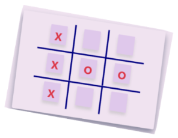

## Challenge

### Develop Tic-Tac-Toe Game

#### Context

Alice is the principal of a kindergarten school in Dover, Delaware, U.S.A. 

The young kids in her school are smart and intelligent, and Alice wants them to excel in all fields and decided to run an intensive learning program for them. 

As a part of the program, Alice wants the young kids to be trained in computers. Hence, she has decided to use web games for the kids to help the kids learn computer but in a fun way. 

One of these games is an interactive Tic Tac Toe web game that two kids can play on the same computer. 

The game must have a replay option that plays the kids' recorded moves so that Alice and her staff can later review the moves of the kids and help them learn and grow accordingly. 

#### Problem Statement

Develop a 2-player 3x3 Tic Tac Toe Game with a feature of replaying the game.

#### Instructions

1. Fork the boilerplate
2. Clone the forked repository
3. Provide the solution code within the file `script.js`.
4. Ensure no other codes get modified.
5. Launch the `index.html` page on the browser to view the rendered output
